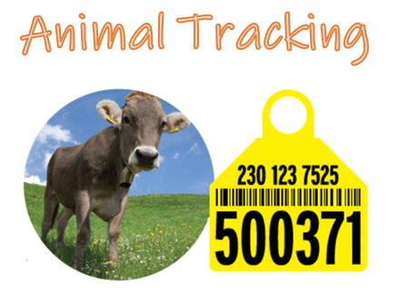
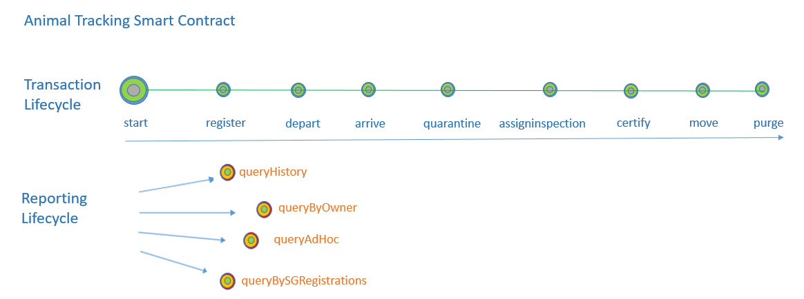

# Animal Tracking Sample

## Overview

This Animal Tracking Package, written in Typescript, is based on the new Hyperledger Fabric 1.4 programming model, is an 'intermediate' level sample of writing a smart contract for an Animal Tracking blockchain network. It has a range of 'typical' transaction types, with varying parameters and functional checks in context, by way of example. It also has 3 'everyday' query transaction types: history, ownership and ad-hoc query functions eg: find records of a certain transaction type + particular species.

There is a tutorial that accompanies this contract/client apps - it is here https://developer.ibm.com/tutorials/integrate-typescript-smart-contract-with-react-based-dashboard-app/

The smart contract, when deployed,  allows participating organisations (some of whom could be those listed below) to submit different transactions (and depending on who is issuing the identities), according to their organisational role / contractual engagement in the network. The sample can be run using one or two organisations too (as provided to VSCode's local Fabric, or using a network taken from Fabric Samples for which a connection file is built) because this is typically what you will do when you set up your local Fabric for development/testing etc). Participating parties (entities, organisations) can potentially be:

  * **Co-operatives** - responsible for Farms and associated parties in a region - the subject of this tutorial (via application, infrastructure)
  * **Farmers** (via application, no infrastructure) - responsible for acquisition, selling, movements, animal welfare on a holding.
  * **Vets** (ditto) - administer healthchecks, medications, administer vaccines if required by an animal.
  * **Abbatoirs** (ditto) -  complete an animal lifecycle (by a strange twist of fate!), record of movement in/out, purging process etc.
  * **Regulator** eg. Defra, Gov.UK  (infrastructure) - track the animal's tracking history, from birth to .... retirement !
  * **Other Goverment Bodies** eg British Cattle Movement Service, also keep records of tracking data of cattle (infrastructure)
    
and potentially others too can access to query/report via client applications.
    
  * **Animal Husbandry Association** - for animal welfare (infrastructure potentially or access via Gov gateway apps)
  * **Society for Animal Science** - for animal science (infrastructure potentially or access via Gov gateway apps)
    
There are 2 Typescript directories, with the same data model file (under the contracts folder) of:
  * the Smart Contract (contract)
  * the client application (client)
    
## General Flow

The diagram below gives a general overview of the 'tracking lifecycle' in terms of transaction and query lifecycle implemented in the smart contract.

## Transactions (Commit)
  
The smart contract can be invoked through the **IBM Blockchain Platform VS Code extension**  (after instantiating the contract on the channel, you will have a list of transactions (that require parameters) to submit from the IBM Blockchain extension sidepanel) - or - it can be invoked using the appropriate client applications too (under , `typescript/client/lib` subdirectory) that you'll have downloaded when you clone(d) the Github repo.
  
The list of transactions are below - if submitting these from the VSCode extension, see comments on supplying parameters below and submit then in the order shown - obviously purge will delete the key (so you may not want to do that yet), but will obviously leave the key's history for querying etc etc:
  
  * register    - provide the data parameters (each in quotes), separated by a comma as shown 
                  `["SHEEPGOAT", "000011", "24/07/2019", "BOVIS_ARIES", "FARMER.JOHN", "AVONDALE.LOC1", "ARRIVAL_AV1", "IN_FIELD", "WOOL", "false"]`

                  
  * depart      - provide 2 data parameters separated by a 'comma' - species, id  Eg. `["SHEEPGOAT", "0009"]`
  
  * arrive      - provide 4 data parameters separated by a 'comma' - species, id, location, owner Eg. `["SHEEPGOAT", "0009", "AVONDALE.LOC1", "FARMER.JUDE"]`
  
  * quarantine  - provide 2 data parameters separated by a 'comma' - species, id  Eg. `["SHEEPGOAT", "0009"]`
  
  * assigninspection  - provide 3 data parameters separated by a 'comma' - species, id, vetId  Eg. `["SHEEPGOAT", "0009","VET001"]`
  
  * certify  - provide 2 data parameters separated by a 'comma' - species, id  Eg. `["SHEEPGOAT", "0009"]`
  
  * move  - move within holding (eg farm) - provide 2 data parameters separated by a 'comma' - species, id  Eg. `["SHEEPGOAT", "0009"]`
  
  * purge  - purge animal eg. visit to abbatoir :-)  - provide 2 data parameters separated by a 'comma' - species, id  Eg. `["SHEEPGOAT", "0009"]`

## Transactions (Query)
   
There are 3 further sample transactions, that perform queries - these do not update the ledger, just queries:
   
  * queryHist  - provide 2 data parameters separated by a 'comma' - species, id  Eg. `SHEEPGOAT, 000011`
   
  * queryByOwner  - provide 1 data parameter - owner  Eg. `FARMER.JUDE`
   
  * queryAdHoc  - provide 1 data parameter - a mango query string that's submitted (eg. `selector:{class: AnimalClass, species: 'SHEEPGOAT'}` )  and returns results of the ad-hoc query string
  
  * queryBySGRegistrations - no parameters - the CouchDB selector is built in the query.ts file Eg. 'SHEEPGOAT','register'
   

## Client side Typescript app scripts

In the `animaltracking/typescript/client/lib` directory are the client SDK app scripts to invoke transactions, or run the query scripts (the compiled JS that is) as per the tutorial.

These app scripts use the file `animaltracking/typescript/client/cfg/clientCfg.json` as the configurable settings to customise it to your own environment (obviously, the accompanying tutorial uses the defaults provided). 

Node JS uses the relative path to the config file, when you run the client apps.

The file `clientCfg.json` controls things like 'which wallet to use', 'which environmment', 'which identity', 'which Fabric channel' etc etc. 

   
## Running the Typescript examples

### How to clone this repo
   
1. git clone https://github.com/mahoney1/animaltracking
   
### initial setup

If you haven't done so already you need to install typescript and optionally tslint into your global npm modules
- npm install -g typescript
- npm install -g tslint

### prepare the contract (the IBP extension will do this for you FYI)
- change to the `animaltracking/typescript/contract` directory
- run `npm install` to install the dependent node modules
- run `npm run build` to compile the typescript to javascript

### prepare the client app
- change to the `animaltracking/typescript/client` directory
- run `npm install` to install the dependent node modules
- run `npm run build` to compile the typescript to javascript

### set up a running Fabric with the contract
Now you need to deploy the contract to a running Fabric. There are many ways this could be done. I would recommend the IBM Blockchain Platform VSCode extension, which sets up a local fabric for you (if you haven't got one). I've provided a link to the [VSCode marketplace](https://marketplace.visualstudio.com/items?itemName=IBMBlockchain.ibm-blockchain-platform)

### to run

Having run the `setupdemo` transaction (no parameters required for local Fabric), it will populate some data on the ledger.

To query the data, run: (`cd to animaltracking/typescript/client/lib`):

`node ./query.js` - runs the query app client to execute query transactions defined in QueryClient.ts (.js compiled from equivalent .ts file)

